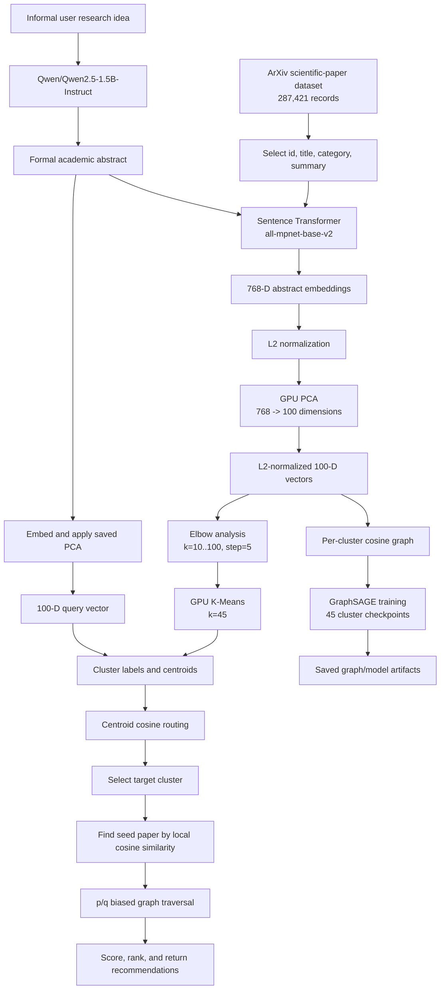

# A Clustered Graph-Based Framework for Semantic Research Paper Retrieval and Recommendation

## Abstract

This project presents a semantic research-paper retrieval and recommendation pipeline designed to reduce the search space of a large scientific-paper collection. The system uses sentence-level representations of paper abstracts, dimensionality reduction, GPU-accelerated K-Means clustering, and cluster-local graph traversal. Given a user's informal research idea, a decoder-only language model first rewrites the idea as an academic-style abstract. The rewritten query is embedded in the same semantic space as the corpus, projected with the fitted PCA transformation, routed to the most similar cluster, and searched locally rather than against all papers.

The source notebooks operate on an arXiv scientific-paper dataset containing 287,421 records. Each retained record contains an arXiv identifier, title, category, abstract/summary, a 768-dimensional embedding, a 100-dimensional PCA representation, and a cluster label.

## Research Objective

An exhaustive comparison between a query and all 287,421 papers is computationally expensive and does not explicitly exploit topical locality. The framework decomposes retrieval into two stages:

1. **Global routing:** compare the query with 45 cluster centroids and select the highest-scoring cluster.
2. **Local recommendation:** search only the graph associated with that cluster.

This reduces the candidate set from the full corpus to one topical region, while graph connectivity allows relevant papers near the initial semantic match to be explored.

## System Architecture

## Data and Representation

The initial notebook loads the Kaggle arXiv scientific research-paper dataset. The working columns are:

- `id`: arXiv paper identifier
- `title`: paper title
- `category`: dataset category
- `summary`: paper abstract

The `abstract_embedding.ipynb` notebook creates embeddings from `summary` using **`sentence-transformers/all-mpnet-base-v2`**. The model produces 768-dimensional dense vectors. Embedding generation is performed in chunks of 20,000 records, with batch size 64 and multi-process GPU encoding, and is written to Parquet.

The clustering notebook parses the stored vectors, constructs a matrix of shape `(287421, 768)`, applies row-wise L2 normalization, and performs all large-scale reduction and clustering steps with RAPIDS cuML on a CUDA GPU.

## Dimensionality Reduction

PCA is fitted once on the normalized corpus embeddings:

- Input dimension: 768
- Output dimension: 100
- Implementation: `cuml.decomposition.PCA`
- Query-time use: the saved PCA mean and components are applied to every new 768-D query
- Post-PCA processing: the 100-D vectors are L2-normalized before clustering and graph construction

The saved PCA transformation is represented by `pca_model_weights.npz`, containing `mean` with shape `(768,)` and `components` with shape `(100, 768)`.

## Clustering and Global Routing

The project evaluates K-Means values from 10 through 100 in increments of 5. For each value, GPU K-Means is configured with `random_state=42`, `n_init=5`, and `max_iter=300`. The elbow is detected automatically with `kneed.KneeLocator` using a convex, decreasing inertia curve. The selected configuration is:

- Number of clusters: **45**
- Final K-Means: cuML `KMeans(n_clusters=45, random_state=42, n_init=10, max_iter=300)`
- Clustering space: normalized 100-D PCA space
- Cluster output: `papers_clustered.parquet`

For cluster $c$, the routing centroid is computed as the arithmetic mean of the cluster's 100-D PCA vectors. The query is routed using cosine similarity:

$$
\operatorname{cluster}(q) = \arg\max_c \frac{q \cdot \mu_c}{\|q\|_2\|\mu_c\|_2}
$$

A representative paper for each non-empty cluster is also selected by maximum similarity to that cluster's K-Means center and saved in `representative_papers.parquet`.

## Per-Cluster Graph Construction

Each cluster becomes an independent similarity graph:

- Node: one paper
- Node feature: its normalized 100-D PCA vector
- Edge: added when pairwise cosine similarity is at least the selected threshold
- Edge attribute: the pairwise cosine similarity
- Metadata: paper ID, title, category, and summary are stored on the PyTorch Geometric `Data` object

Threshold selection is graph-density driven. Candidate thresholds are evaluated over approximately `0.40` to `0.85` in increments of `0.05`; the production loop prefers an average degree near 10 while accepting a range of approximately 5 to 18. The resulting graph and threshold are saved in `cluster_<id>.pt` files.

The graph is represented with PyTorch Geometric and converted to NetworkX for query-time traversal. Edges are generated in both directions by the tensor threshold operation, then interpreted as an undirected graph during NetworkX traversal.

## Graph Representation Learning

The graph model named `ClusterGraphSAGE` is a two-layer GraphSAGE network:

1. `SAGEConv(100, hidden_channels)`
2. ReLU activation
3. Dropout, tuned in the range 0.1 to 0.5
4. `SAGEConv(hidden_channels, 128)`
5. L2 normalization of the output node representations

The hidden dimension is selected from `{128, 256, 512}`. Training uses Adam and a positive/negative edge objective. Positive edges maximize the dot product of endpoint representations; randomly sampled destination nodes provide negative examples. The final all-cluster training pass uses 100 epochs after HPO and saves model weights, graph data, thresholds, and refined embeddings.

Although the GraphSAGE embeddings are produced and stored, the current `ClusterPredictor` implementation performs seed selection and traversal scoring with `graph_data.x`, the original 100-D PCA node features. The trained GraphSAGE vectors are therefore artifacts of the representation-learning stage, but are not currently used for the final cosine score in the checked-in prediction path.

## Query Processing and Decoder Model

The prediction notebook accepts an informal research idea and formats it with **`Qwen/Qwen2.5-1.5B-Instruct`**. The model is loaded with Hugging Face Transformers using `AutoTokenizer` and `AutoModelForCausalLM`, with `torch.float16` and automatic device placement.

The prompt instructs the model to rewrite the input as a formal computer-science abstract focused on the problem, methodology, and technical domain, returning only the abstract text. Generation uses:

- `max_new_tokens=256`
- `temperature=0.7`
- `do_sample=True`

The generated abstract is then embedded with `all-mpnet-base-v2`, transformed by the saved PCA parameters, and converted to the same 100-D representation used for centroid routing and local graph search.

## Illustrative Prediction Example

The final cell of `06_testing_the_prediction.ipynb` demonstrates the complete inference path for the following informal input:

> **User input:** how do robots learn to pick up things from watching people on youtube videos

The decoder produced the following formal abstract:

> **Qwen-formatted abstract:** The objective of this study is to investigate how robots can be trained to perform tasks such as picking up objects by mimicking human actions observed in YouTube videos. The methodology involves developing algorithms that enable robots to analyze and replicate human movements through video-based learning techniques. This approach aims to enhance robotic autonomy in real-world applications where direct interaction with humans may not always be feasible or desirable. The primary focus lies in understanding the transferability of learned skills between different types of tasks and environments, thereby contributing to advancements in robotics technology.

The resulting abstract was encoded into a 768-dimensional `all-mpnet-base-v2` vector and projected into the 100-dimensional PCA space. The predictor then computed cosine similarity between the query vector and **all 45 cluster centroids**. The maximum observed similarity was:

| Routing quantity | Observed result |
|---|---:|
| Selected cluster | **Cluster 1** |
| Maximum centroid cosine similarity | **0.6934** |
| Number of evaluated centroids | **45** |

The notebook output displays the winning centroid and its score, rather than printing the complete 45-element similarity vector. Cluster 1 was therefore selected for localized graph search. With the notebook's default traversal parameters (`p=0.7442`, `q=2.9471`), maximum depth 3, and score threshold `0.15`, the top five returned papers were:

| Rank | Recommended paper | Score | arXiv identifier | arXiv URL |
|---:|---|---:|---|---|
| 1 | Robot Learning from Human Videos: A Survey | 0.9024 | `2604.27621v1` | [arxiv.org/abs/2604.27621v1](https://arxiv.org/abs/2604.27621v1) |
| 2 | Imitation from Observation: Learning to Imitate Behaviors from Raw Video via Context Translation | 0.4826 | `1707.03374v2` | [arxiv.org/abs/1707.03374v2](https://arxiv.org/abs/1707.03374v2) |
| 3 | SafeMimic: Towards Safe and Autonomous Human-to-Robot Imitation for Mobile Manipulation | 0.4690 | `2506.15847v1` | [arxiv.org/abs/2506.15847v1](https://arxiv.org/abs/2506.15847v1) |
| 4 | ZeroMimic: Distilling Robotic Manipulation Skills from Web Videos | 0.4680 | `2503.23877v1` | [arxiv.org/abs/2503.23877v1](https://arxiv.org/abs/2503.23877v1) |
| 5 | Imitating What Works: Simulation-Filtered Modular Policy Learning from Human Videos | 0.4659 | `2602.13197v2` | [arxiv.org/abs/2602.13197v2](https://arxiv.org/abs/2602.13197v2) |

This example indicates that the semantic route identified a robotics and human-video-learning neighborhood, after which the graph-based local ranking returned papers related to imitation learning, video-based robot learning, and manipulation. The values above are a recorded notebook run, not a corpus-wide accuracy claim; the decoder uses stochastic generation (`temperature=0.7`, `do_sample=True`), so regenerated outputs may vary.

## Localized Search

After centroid routing, the target checkpoint is loaded and the query is compared with every node in that cluster using cosine similarity. The highest-scoring node is the seed. The current traversal is a bounded breadth-first procedure with maximum depth 3.

For a node with current traversal probability $r$, degree $d$, and neighbor $v$, the next probability is implemented as:

$$
 r_{next} = r \cdot \frac{1}{d} \cdot b(v),
 \qquad
 b(v) =
 \begin{cases}
 1/p, & v \text{ is the seed node}\\
 1/q, & \text{otherwise}
 \end{cases}
$$

Each visited node receives the combined score:

$$
 S(v) = 0.6\,\operatorname{cos}(q,x_v) + 0.4\,r(v)
$$

The predictor ranks visited nodes by this score and returns records whose score is at least the configured threshold, with the default set to `0.15`. Results include paper ID, title, and score; the notebook can convert IDs into arXiv URLs.

## Hyperparameter Optimization

The project uses **Optuna** for black-box hyperparameter optimization. Because `optuna.create_study(direction="minimize")` does not specify a sampler, Optuna's default **TPE (Tree-structured Parzen Estimator) sampler** is used.

There are two HPO stages:

### GraphSAGE HPO

For each sufficiently connected cluster in the all-cluster training notebook, Optuna minimizes the final training loss after 30 quick training epochs over:

| Parameter | Search space |
|---|---|
| Learning rate | log-uniform float from `1e-3` to `0.1` |
| Hidden channels | categorical: `128`, `256`, `512` |
| Dropout | float from `0.1` to `0.5` |

The production loop uses 5 trials per cluster to limit GPU memory and runtime. The earlier cluster-0 experiment uses 15 trials.

### Local traversal `p` and `q` HPO

Notebook `05_hyperparameter_tuning_for_localized_search.ipynb` tunes the traversal parameters with a separate Optuna study. It minimizes the negative mean of visited-node combined scores, which is equivalent to maximizing their mean. Both parameters use continuous uniform search spaces:

| Parameter | Search space | Role in implementation |
|---|---|---|
| `p` | `0.1` to `5.0` | Return-to-seed bias |
| `q` | `0.1` to `5.0` | Non-seed exploration bias |

The notebook runs 15 trials for sample cluster 12 and reports an example of `p=0.7442`, `q=2.9471`, with a best path score of `1.0000`. The checked-in notebook does not loop over all 45 clusters or save a per-cluster `p,q` mapping; the `ClusterPredictor` defaults to these example values. Thus, per-cluster optimized `p,q` values should be treated as a planned extension unless they have been generated separately.

## Generated Artifacts

The notebooks refer to the following files:

- `01_arxiv_with_embeddings.parquet`: source table after embedding generation
- `papers_clustered.parquet`: corpus with embeddings, PCA vectors, and cluster labels
- `representative_papers.parquet`: representative paper for each non-empty cluster
- `pca_model_weights.npz`: PCA mean and component matrix
- `gnn_cluster_models/cluster_<id>.pt`: graph, metadata, threshold, model state, and node embeddings for a cluster
- `gnn_cluster_models/cluster_thresholds.pt`: cluster-to-threshold mapping
- `gnn_cluster_models/cluster_centroids.pt`: cached centroid routing data used by `ClusterPredictor`

The paths in the notebooks are Google Drive paths under `/content/drive/MyDrive/`; update them for another environment.

## Notebook Guide

| Notebook | Purpose |
|---|---|
| [`abstract_embedding.ipynb`](code/abstract_embedding.ipynb) | Load the Kaggle data and generate 768-D abstract embeddings |
| [`02_data_clustering_phase.ipynb`](code/02_data_clustering_phase.ipynb) | Normalize, reduce to 100 dimensions, select `k`, cluster, and save corpus artifacts |
| [`03_forming_graphical_representation_and_training_cluster0.ipynb`](code/03_forming_graphical_representation_and_training_cluster0.ipynb) | Prototype threshold selection, graph construction, and GraphSAGE/Optuna training for cluster 0 |
| [`04_training_gcn_for_all_45_clusters.ipynb`](code/04_training_gcn_for_all_45_clusters.ipynb) | Build and train graph models for all 45 clusters and cache centroids |
| [`05_hyperparameter_tuning_for_localized_search.ipynb`](code/05_hyperparameter_tuning_for_localized_search.ipynb) | Optimize traversal parameters `p` and `q` with Optuna |
| [`06_testing_the_prediction.ipynb`](code/06_testing_the_prediction.ipynb) | Format a raw query, embed it, route it, and return recommendations |

## Reproducibility Workflow

1. Run `abstract_embedding.ipynb` in Kaggle or a GPU-enabled environment.
2. Run `02_data_clustering_phase.ipynb` to fit PCA, select 45 clusters, and save the clustered Parquet files and PCA weights.
3. Run `04_training_gcn_for_all_45_clusters.ipynb` to create cluster graphs, train GraphSAGE models, save thresholds, and cache centroids.
4. Run `05_hyperparameter_tuning_for_localized_search.ipynb` to tune traversal parameters for a selected cluster/query setup.
5. Run `06_testing_the_prediction.ipynb` with the generated artifacts and updated storage paths.

The notebooks are written for Google Colab and assume access to a CUDA GPU, Google Drive, RAPIDS cuDF/cuML, PyTorch Geometric, NetworkX, Optuna, Sentence Transformers, Transformers, PyArrow, and `kneed`.

## Evaluation Considerations and Limitations

The repository currently demonstrates an end-to-end retrieval path but does not include a conventional benchmark with train/validation/test splits, retrieval metrics such as Recall@k or nDCG@k, latency measurements against exhaustive search, or an ablation study. The decoder uses stochastic generation, and its rewritten abstract can change across runs unless generation is made deterministic. The current p/q HPO objective evaluates the mean traversal score on one selected seed/query configuration, so it is not yet a general validation objective across users or clusters.

For a publishable evaluation, report routing accuracy, candidate-space reduction, retrieval quality, wall-clock latency, memory usage, and comparisons with exhaustive cosine search and non-graph baselines. Also consider using the trained GraphSAGE embeddings consistently in seed selection and final ranking, or explicitly justify retaining the PCA features for those operations.

## License and Dataset Attribution

The notebooks use a Kaggle-hosted arXiv scientific research-paper dataset. Add the dataset's official citation, license, and any project-specific software license here before redistribution.
